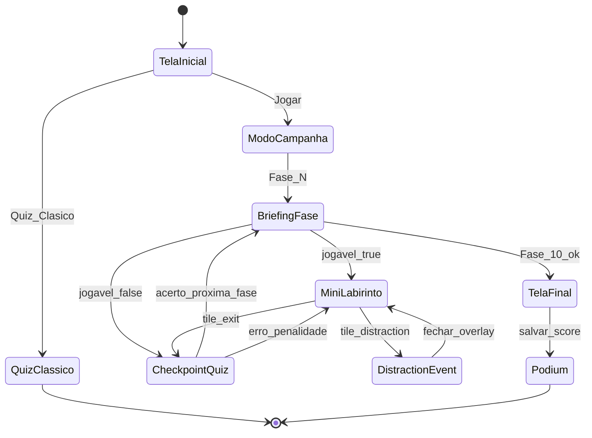

# Spec: Cyber Maze — Atualizações solicitadas pelos alunos

**Status:** Proposta para implementação  
**Origem:** Documento técnico "Cyber Maze – Escape da Internet" (alunos apresentadores)  
**Base de código:** Hacker Quiz — Carreira de Engenharia de Software (`index.html`, `style.css`, `app.js`)  
**ADR relacionado:** [adr/001-labirinto-canvas-tilemap.md](../adr/001-labirinto-canvas-tilemap.md)

---

## 1. Goal

O jogador percorre mini-labirintos digitais temáticos, supera distrações visuais que simbolizam o excesso de internet e responde às **perguntas originais do Hacker Quiz** nos checkpoints de cada fase; ao concluir a campanha, recebe a mensagem educativa *"A internet é uma ferramenta. Não deixe ela controlar você."*

---

## 2. Non-goals

- **Não** alterar enunciados, alternativas nem respostas das 30 perguntas existentes em `poolPerguntas` (`app.js`).
- **Não** implementar 10 labirintos únicos hand-crafted com qualidade de jogo comercial.
- **Não** implementar monstro com pathfinding (perseguição inteligente em tempo real).
- **Não** implementar scroll infinito como mecânica jogável contínua.
- **Não** implementar paredes móveis dinâmicas em múltiplas fases.
- **Não** adicionar backend, autenticação, ranking global ou multiplayer.
- **Não** introduzir game engine (Phaser, Unity WebGL) nem build step obrigatório.
- **Não** renomear `app.js` para `script.js` apenas por estética do documento dos alunos.
- **Não** substituir o modo Quiz Clássico — ele permanece acessível na tela inicial (rollback e acessibilidade).

---

## 3. User stories

### Happy paths

**US-01 — Iniciar campanha**

- **Given** o jogador está na tela inicial com título "Cyber Maze – Escape da Internet"
- **When** clica em "Jogar"
- **Then** vê a Fase 1 (Login Inicial) com briefing narrativo e entra no mini-labirinto

**US-02 — Explorar labirinto**

- **Given** o jogador está em uma fase com labirinto ativo
- **When** usa setas/WASD ou o D-pad touch para se mover
- **Then** o personagem se desloca no grid, colide com paredes e pode ativar tiles de distração ou saída

**US-03 — Checkpoint de pergunta na saída**

- **Given** o jogador alcançou a tile de saída (`exit`) da fase
- **When** a pergunta mapeada à fase é exibida (conteúdo intacto de `poolPerguntas`)
- **Then** ao confirmar resposta correta, a próxima fase é desbloqueada; explicação educativa é mostrada como hoje

**US-04 — Fechar distração**

- **Given** um pop-up ou notificação fake aparece durante a exploração
- **When** o jogador fecha o overlay
- **Then** retorna ao labirinto e a barra de atenção recupera parcialmente

**US-05 — Concluir campanha**

- **Given** o jogador acertou a pergunta da Fase 10 (Desconexão Final)
- **When** a fase é concluída
- **Then** vê a mensagem final educativa, estatísticas da campanha e opção de salvar codinome no pódio local

**US-06 — Modo Quiz Clássico**

- **Given** o jogador prefere experiência sem labirinto (acessibilidade ou preferência)
- **When** escolhe "Quiz Clássico" na tela inicial
- **Then** o fluxo atual (10 perguntas sorteadas, pódio, áudio) funciona sem regressão

### Caminhos de erro

**US-07 — Resposta incorreta no checkpoint**

- **Given** o jogador respondeu incorretamente na saída da fase
- **When** confirma a resposta
- **Then** é teleportado ao spawn da fase, perde 15 segundos do timer global e vê feedback com explicação

**US-08 — Timer esgotado (Trace Detected)**

- **Given** o timer global da campanha chegou a zero
- **When** o jogador ainda não concluiu a Fase 10
- **Then** vê overlay "TRACE DETECTED — SISTEMA RASTREANDO", opção de reiniciar campanha ou voltar ao menu

**US-09 — Tone.js indisponível**

- **Given** o CDN de Tone.js falhou ao carregar
- **When** o jogador inicia campanha ou quiz clássico
- **Then** o jogo continua sem áudio, com aviso no console (comportamento já existente)

### Casos de borda

**US-10 — Progresso parcial persistido**

- **Given** o jogador concluiu fases 1–3 e recarrega a página
- **When** retorna ao jogo
- **Then** progresso da campanha é restaurado de `localStorage` (fase atual e timer restante)

**US-11 — prefers-reduced-motion**

- **Given** o SO do usuário solicita movimento reduzido
- **When** distrações ou transições seriam animadas
- **Then** animações de glitch/pop-up são suprimidas ou simplificadas (alinhado a `style.css`)

---

## 4. Data model

### Entidades em memória

#### `FaseConfig`

| Campo | Tipo | Obrigatório | Descrição |
|-------|------|-------------|-----------|
| `id` | `number` (1–10) | sim | Identificador da fase |
| `titulo` | `string` | sim | Nome temático (ex.: "Firewall de Segurança") |
| `narrativa` | `string` | sim | Texto de briefing antes do labirinto |
| `tilemapRef` | `string` | sim | Referência ao mapa (`base`, `base-mirror`, `narrativa-only`) |
| `perguntaId` | `number` | sim | ID em `poolPerguntas` (1–30) |
| `distractions` | `DistractionConfig[]` | não | Pop-ups/notificações da fase |
| `jogavel` | `boolean` | sim | `true` = labirinto ativo; `false` = slide narrativo + pergunta direta |
| `timerFaseSegundos` | `number` | não | Override do tempo sugerido para a fase |

#### `DistractionConfig`

| Campo | Tipo | Descrição |
|-------|------|-----------|
| `tipo` | `'popup' \| 'notification' \| 'blink-ad'` | Tipo visual |
| `titulo` | `string` | Texto do overlay |
| `atencaoDelta` | `number` | Quanto a barra de atenção cai ao abrir (ex.: -10) |
| `triggerTile` | `{ x, y }` | Tile que dispara (opcional; senão aleatório após N segundos) |

#### `ProgressoCampanha` (persistido em `localStorage`)

Chave proposta: `cyberMazeProgresso`

| Campo | Tipo | Descrição |
|-------|------|-----------|
| `faseAtual` | `number` | Próxima fase a jogar (1–10) |
| `fasesConcluidas` | `number[]` | IDs das fases já concluídas |
| `tempoRestanteSegundos` | `number` | Timer global restante |
| `atencaoAtual` | `number` | 0–100, barra de atenção |
| `inicioCampanha` | `number` | Timestamp ISO para estatísticas |

### Tilemap base (JSON estático)

Grid sugerido: **15×11 tiles**, tile size **32px** (Canvas 480×352 lógico).

| Valor | Significado |
|-------|-------------|
| `0` | Chão walkable |
| `1` | Parede |
| `2` | Spawn do jogador |
| `3` | Saída / portal (dispara checkpoint) |
| `4` | Trigger de distração |
| `5` | Porta bloqueada (desbloqueia após acerto em fases futuras; opcional v2) |

Arquivo proposto na implementação: `maze/tilemaps/base.json` (sem bundler; carregado via `fetch` ou inline).

### Mapeamento fase → pergunta (proposta v1)

Uma pergunta por fase, ordem fixa. Cobre 10 das 30 perguntas; as 20 restantes ficam no modo Quiz Clássico.

| Fase | Título temático | `perguntaId` | Categoria | Racional (metáfora) | v1 jogável? |
|------|-----------------|--------------|-----------|---------------------|-------------|
| 1 | Login Inicial | 1 | Dia a Dia | Entrada no "sistema" — o que engenheiros fazem | **Sim** (labirinto) |
| 2 | Firewall de Segurança | 4 | Dia a Dia | "Bug" como falha de segurança | Narrativa + pergunta |
| 3 | Banco de Dados | 26 | Tecnologias | Stack / camadas de dados | Narrativa + pergunta |
| 4 | Rede Criptografada | 28 | Tecnologias | Backend / infraestrutura | Narrativa + pergunta |
| 5 | Servidor Central | 7 | Níveis de Carreira | Complexidade crescente | Narrativa + pergunta |
| 6 | Ataque de Pop-ups | 3 | Dia a Dia | Distração vs. trabalho em equipe | **Sim** (labirinto + pop-ups) |
| 7 | Vício em Scroll | 18 | Onde Trabalhar | Remoto / telas / hábitos digitais | Cutscene CSS + pergunta |
| 8 | Sistema Corrompido | 5 | Dia a Dia | Identidade / ruído no sistema | Glitch CSS + pergunta |
| 9 | Núcleo da Rede | 29 | Tecnologias | Full stack — núcleo integrado | Narrativa + pergunta |
| 10 | Desconexão Final | 12 | Formação | Reflexão sobre caminho e escolhas | **Sim** (tela vitória + pergunta) |

> **Validação pendente:** alunos/professor confirmam se a ordem e os IDs atendem à apresentação. Ajuste só permuta IDs — **nunca** editar texto das perguntas.

### Invariantes

- `perguntaId` deve existir em `poolPerguntas`.
- Cada `perguntaId` aparece no máximo uma vez na campanha.
- Fases só desbloqueiam sequencialmente (1 → 2 → … → 10).
- Conteúdo de pergunta renderizado via funções existentes (`embaralharAlternativas`, feedback, explicação).

### Migrações

Nenhuma migração de banco. Nova chave `localStorage` não conflita com `hackerQuizPodium` nem `hackerQuizUltimaPartida`.

---

## 5. Observabilidade

Aplicação estática sem backend — **sem telemetria em produção** na v1.

| Sinal | v1 | Notas |
|-------|-----|-------|
| Métricas RED | N/A | Sem servidor; sem rate de erro HTTP |
| Logs estruturados | Dev only | Eventos `console.info` em modo debug: `campanha_iniciada`, `fase_concluida`, `checkpoint_erro`, `timer_esgotado` |
| Traces | N/A | — |
| Alertas | N/A | — |
| Playtest manual | **Obrigatório** | Tempo médio por fase, taxa de desistência, legibilidade mobile, fechamento de pop-ups |

**Critério de sucesso em playtest:** 3 participantes concluem campanha v1 em ≤ 20 min sem bloqueio; nenhuma regressão no Quiz Clássico.

---

## 6. Threat model

### AuthN/Z

- Sem autenticação. Qualquer visitante joga localmente.
- Pódio e progresso são dados locais do navegador — outro dispositivo não vê o progresso.

### Validação de entrada

- Codinome no pódio: reutilizar `utils.sanitizarNome` (máx. 20 chars, alfanumérico + `_-`).
- Progresso em `localStorage`: validar JSON e ranges (fase 1–10, atenção 0–100) antes de aplicar.

### Secrets e PII

- Sem secrets no cliente.
- Pódio armazena codinome escolhido pelo usuário — tratar como dado local não sensível; sem envio a servidores.

### Vetores de abuso

- Pop-ups **não** carregam URLs externas nem `iframe` de terceiros — apenas HTML/CSS estático.
- Proibido `eval`, `innerHTML` com input do usuário sem sanitização.
- Distrações limitadas a 3 por fase para evitar DoS de UX (travamento perceptivo).

### Alinhamento stack

- Deploy GitHub Pages estático; sem superfície de API pública.
- CDN Tone.js e Google Fonts — risco de supply chain já aceito no projeto original; manter fallback sem áudio.

---

## 7. Rollout

### Feature flag (constante em `app.js`)

```javascript
const FEATURES = {
  modoCampanha: true,   // Cyber Maze
  quizClassico: true    // fluxo atual
};
```

### Ordem de entrega incremental

| Entrega | Conteúdo | Deploy |
|---------|----------|--------|
| **v1.0** | Rebrand + 3 fases jogáveis (1, 6, 10) + 7 narrativas + timer/barra atenção | GitHub Pages |
| **v1.1** | Segundo tilemap (`base-mirror`) para fases 4 e 8 | GitHub Pages |
| **v1.2** | D-pad mobile polido + persistência de progresso | GitHub Pages |

### Migração de dados

Nenhuma migração pré-deploy. Chave nova `cyberMazeProgresso` convive com chaves existentes.

### Dependências

- Nenhum serviço externo além de CDNs já usados (Tone.js, fonts).
- Ordem: implementar engine de maze → integrar checkpoint quiz → rebrand UI.

---

## 8. Rollback

- Botão **"Quiz Clássico"** permanece na tela inicial — desativa fluxo de campanha sem remover código.
- `FEATURES.modoCampanha = false` reverte UI para comportamento atual em um único commit.
- `localStorage` da campanha pode ser ignorado pelo Quiz Clássico; limpar chave `cyberMazeProgresso` reseta campanha.
- Estado do banco: inexistente — rollback é apenas deploy de versão anterior no GitHub Pages.

---

## 9. Expectativa vs realidade

Seção para alinhamento com os apresentadores — traduz o documento técnico deles para o que o stack atual entrega com qualidade.

### Legenda

- **Sim** — viável com qualidade no HTML/CSS/JS atual
- **Parcial** — viável com escopo reduzido (híbrido)
- **Não** — inviável com qualidade sem mudar stack ou investimento grande

### Matriz por seção do documento dos alunos

| Seção / pedido | Status | O que entregamos (escopo híbrido v1) |
|----------------|--------|--------------------------------------|
| Título Cyber Maze + subtítulo + botão Jogar | Sim | Rebrand em `index.html` |
| Mensagem "A internet pode conectar..." | Sim | Copy na tela inicial |
| Labirinto + movimentação teclado | Parcial | Mini-labirinto real nas fases 1, 6 e 10 |
| Movimentação toque | Parcial | D-pad na tela (v1.2); swipe não prioritário |
| Colisão com paredes | Sim | Grid tile-based no Canvas |
| Salas/páginas digitais interativas | Parcial | Overlays modais estilizados, não salas 3D |
| Perguntas automáticas em pontos estratégicos | Sim | Tile `exit` dispara checkpoint |
| Acerto desbloqueia fase | Sim | Gate sequencial |
| Erro: voltar / perder tempo | Sim | Teleport spawn + -15s timer |
| 10 fases temáticas | Parcial | 10 temas narrativos; 3 com labirinto jogável na v1 |
| Pop-ups, notificações, anúncios piscando | Parcial | 2–3 overlays CSS por fase relevante |
| Glitches visuais | Sim | CSS existente + fase 8 |
| Caminhos falsos | Parcial | Dead-ends no tilemap, não geração procedural |
| Scroll infinito | Não (gameplay) | Cutscene CSS fake na fase 7 |
| Portas com senha | Parcial | Opcional v2; checkpoint já funciona como "senha" |
| Firewalls bloqueando caminhos | Parcial | Paredes extras no mesmo mapa |
| Temporizador de pressão | Sim | Timer global de campanha |
| Barra de atenção | Sim | UI nova; substituto do "monstro" |
| Monstro correndo atrás | **Não** | Substituído por Trace Detector (timer + alerta sonoro) |
| 100% perguntas originais intactas | Sim | `poolPerguntas` sem edição de conteúdo |
| Estética cyber/neon | Sim | Extensão da paleta em `style.css` |
| Mensagem final educativa | Sim | Tela Fase 10 |
| Objetivo educacional reflexão + lógica | Sim | Quiz + narrativa wrapper |
| `script.js` separado | Parcial | Manter `app.js`; opcional extrair `questions.js` |
| Pódio local | Sim | Preservado ao fim da campanha |

### Resumo executivo para apresentação oral

| Pedido dos alunos | Status | Entrega híbrida |
|-------------------|--------|-----------------|
| Labirinto + movimento | Parcial | Mini-labirinto em 3 fases |
| 10 fases | Parcial | 10 temas; 3 jogáveis na v1 |
| Monstro | Não | Timer + trace + barra de atenção |
| Pop-ups / distrações | Sim | Overlays CSS |
| Perguntas originais | Sim | 100% intactas |
| Mensagem final | Sim | Tela de desconexão |

### Limitação pedagógica (transparente)

As perguntas tratam de **carreira em Engenharia de Software**; a narrativa pede **conscientização sobre uso excessivo da internet**. Com o requisito de não alterar perguntas, o jogo usa a invasão digital como **metáfora visual** — a reflexão sobre internet vem da mensagem final e das distrações (pop-ups, timer), não do enunciado das perguntas.

---

## 10. Escopo híbrido v1 (detalhamento)

### Arquitetura alvo



### Fases jogáveis na v1 (labirinto real)

| Fase | Mapa | Distrações | Notas |
|------|------|------------|-------|
| 1 Login | `base.json` | 1 pop-up "Faça login" | Tutorial de controles |
| 6 Pop-ups | `base.json` | 3 pop-ups invasivos | Barra de atenção central |
| 10 Desconexão | `base.json` | nenhuma | Saída → pergunta → tela vitória |

### Fases narrativas na v1 (sem labirinto)

Fases 2–5, 7–9: tela de briefing temático + pergunta direta (reutiliza UI de quiz existente). Indicador visual "Fase bloqueada / narrativa" na seleção opcional.

### Substituto do monstro: Trace Detector

| Elemento | Comportamento |
|----------|---------------|
| Timer global | 15 minutos iniciais; -15s por erro |
| Barra de atenção | 100 → decai com pop-ups; < 20 acelera timer |
| Overlay | "TRACE DETECTED" quando timer < 60s |
| Áudio | Reutilizar camada `alertSynth` / SFX existentes |
| Game over | Timer zero → reiniciar campanha ou menu |

### Preservação do existente

Não regredir: pódio (`podiumManager`), anti-repetição (Quiz Clássico), Tone.js + mute, `prefers-reduced-motion`, ARIA no feedback, deploy estático GitHub Pages.

### Estrutura de arquivos proposta (implementação futura)

```
/
├── index.html
├── style.css
├── app.js              # orquestração + quiz (existente, estendido)
├── questions.js        # opcional: poolPerguntas extraído
├── maze/
│   ├── engine.js       # Canvas 2D, colisão, input
│   ├── tilemaps/
│   │   └── base.json
│   └── fases-config.js # FaseConfig[]
└── specs/
    └── cyber-maze-atualizacoes-alunos.md
```

Sem bundler — scripts via `<script defer>` em ordem de dependência.

---

## 11. Open questions

| # | Questão | Impacto | Responsável sugerido | Prazo |
|---|---------|---------|----------------------|-------|
| OQ-1 | Confirmar mapeamento fase → `perguntaId` (tabela seção 4) | Ordem da campanha | Alunos + professor | Antes da implementação |
| OQ-2 | Fases 2–5 e 7–9: narrativa-only na v1 ou aguardar v1.1 com segundo mapa? | Escopo v1 | Product owner / professor | Decisão de sprint |
| OQ-3 | Aceitar metáfora narrativa (internet) vs. conteúdo das perguntas (carreira)? | Discurso na apresentação | Alunos apresentadores | Antes da apresentação |
| OQ-4 | Timer global: 15 min é adequado para demo ao vivo? | UX apresentação | Playtest com 3 pessoas | Durante implementação |
| OQ-5 | Extrair `poolPerguntas` para `questions.js` na v1 ou adiar? | Manutenção | Dev implementador | Baixa prioridade |
| OQ-6 | Pódio ao fim da campanha: score por acertos, tempo restante ou composto? | Regra de pontuação | Alunos | Antes da Fase 10 |

---

## Critério de completude desta spec

- [x] Goal é resultado visível, não implementação
- [x] Non-goals tem pelo menos dois itens
- [x] User stories cobrem happy path, erro e borda
- [x] Data model com mapeamento fase → pergunta
- [x] Observabilidade declarada (playtest manual)
- [x] Threat model com auth, validação e abuso
- [x] Rollout e rollback definidos
- [x] Open questions com responsáveis
- [x] Seção Expectativa vs realidade para gestão de expectativa dos alunos

**Próximo passo:** implementação em sessão separada (agente normal), seguindo esta spec e [adr/001-labirinto-canvas-tilemap.md](../adr/001-labirinto-canvas-tilemap.md).
